# How to Map Network Drive from EC2 Windows Instance to Any Local Machine or On-premises Network  
Hi All,

In this blog I will explain how to Map Network Drive from AWS EC2 Windows Machine to Any Local Machine or On-premises Network.

I am assuming that you have a Launched an Windows EC2 instance on AWS and login to the server.

# Follow step by step 

Make sure mentioned ports (3389, 445)needs to be open security group

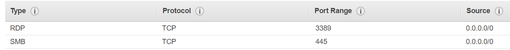

After that we need make sure to modify Advance sharing settings 

(Turn on sharing access to certian networks like all networks, private and public) as per our need

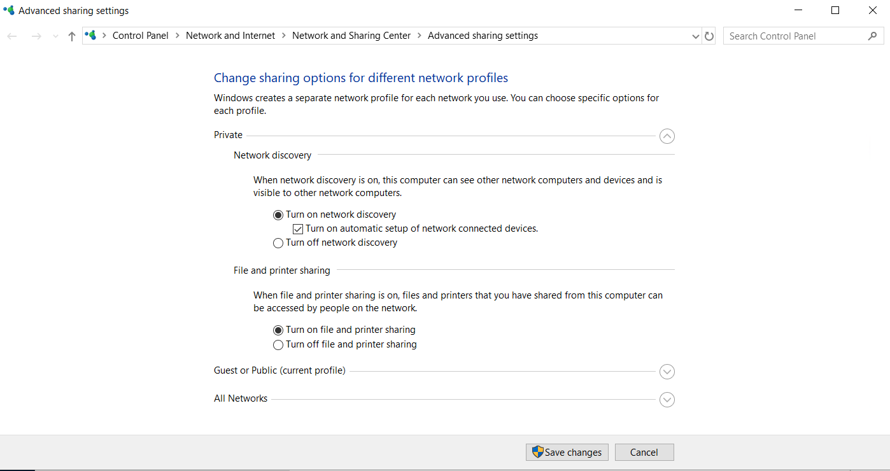

Now go to file explorer and select which one you want to give access to the end user

You can create a new folder or select Existing Folder/Existing Drive to share

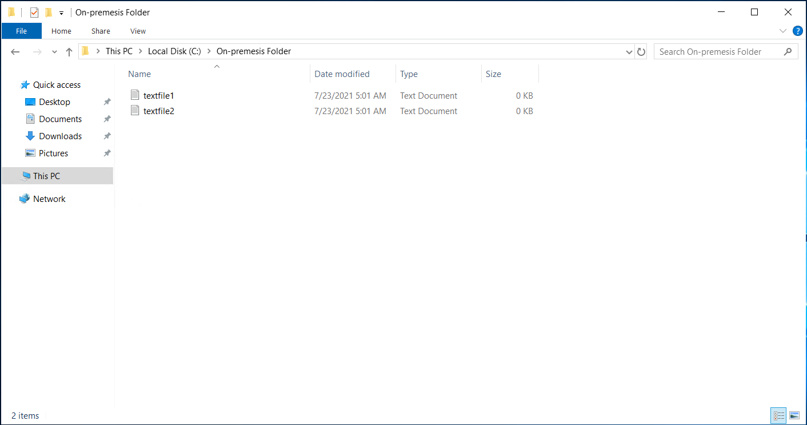

select folder

Right click and slect Properites Then click on sharing select share

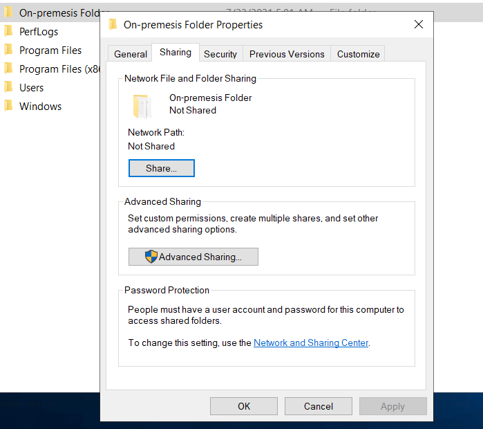

If you are not configured previously in advance sharing settings 
It will prompt you to select either public or private

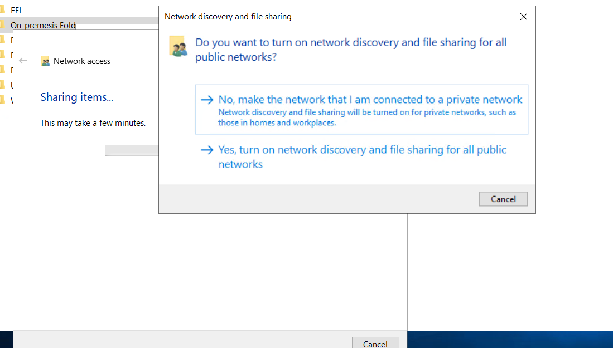

Once you got the sharing link its look like below image

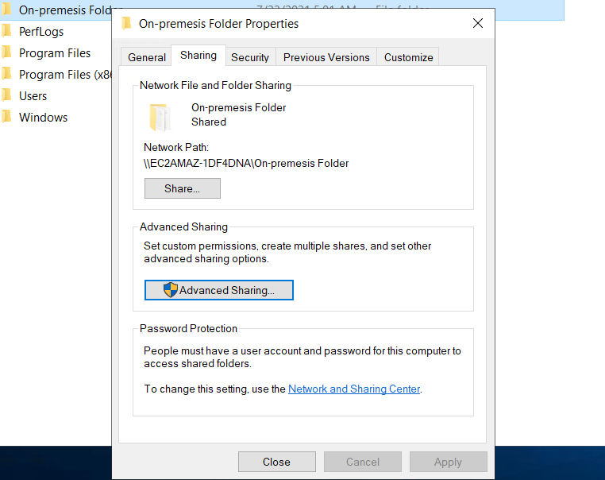

After that in security path we need to select user and give required permissions 

To make access of that folder for specific user

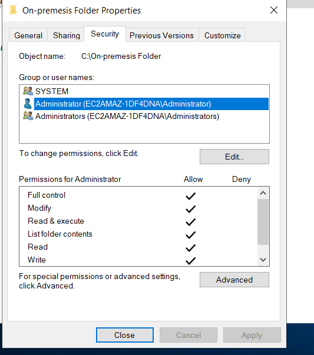

Then go to Local machine or On premis=esis netowrk 

In file explorer select This PC on top select computer 

In computer section choose map network drive click on it.

And mention the path of the folder in AWS Instance

Remember mention IP instead of hostname to avoid issues

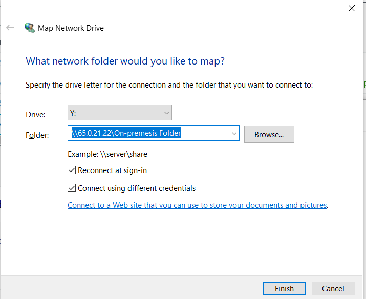

Then click on Finish 

IT will ask credentials 

Enter username and passowrd

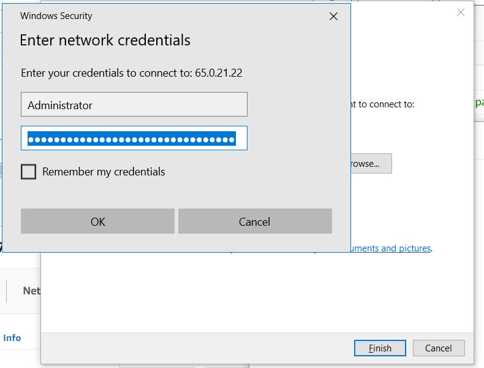

Then succesfully you can access the network map drive

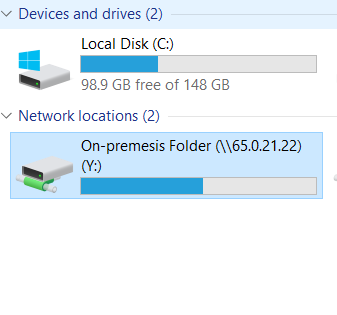

You can check the files in the folder also

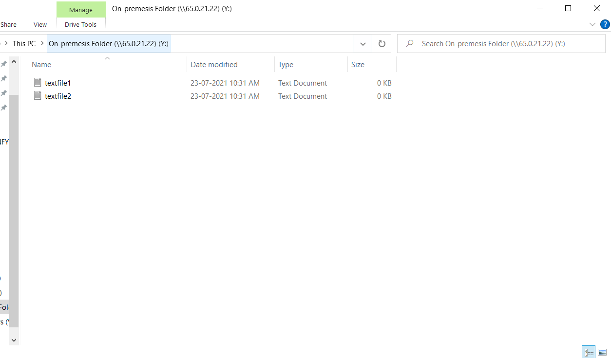

Hope you configured successfully

# Happy Learning!
